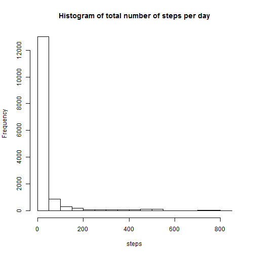
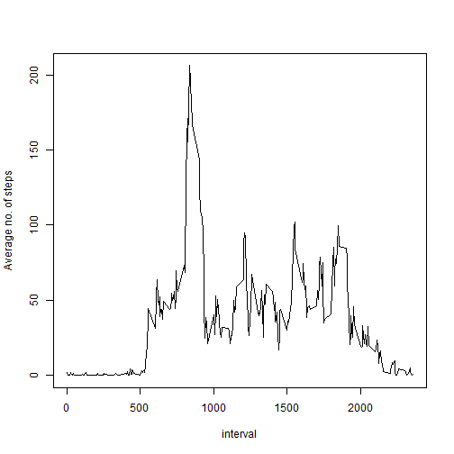
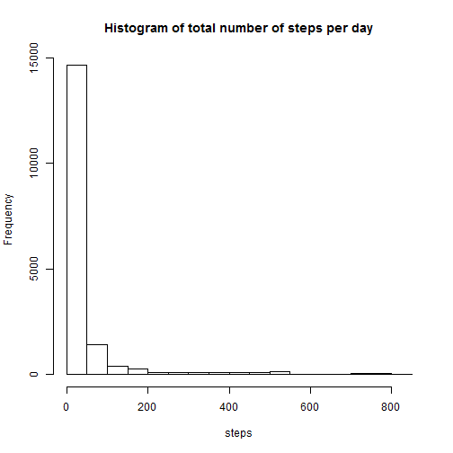
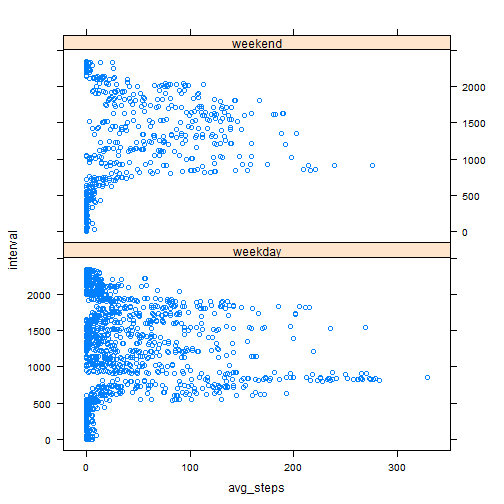

```r
data <- read.csv("activity.csv");
avg_step_per_interval <- aggregate(data$steps, by=list(data$interval), FUN=mean, na.rm = TRUE);
avg_step_per_interval <- setNames(avg_step_per_interval, c("interval", "avg_steps"));
```
### What is mean total number of steps taken per day?  

1. Calculate the total number of steps taken per day


```r
sum(data$steps,na.rm = TRUE)
```

```
## [1] 570608
```

2. If you do not understand the difference between a histogram and a barplot, research the difference between them. Make a histogram of the total number of steps taken each day


```r
hist(data$steps, main = paste("Histogram of total number of steps per day"),xlab = "steps");
```

 

3. Calculate and report the mean and median of the total number of steps taken per day


```r
mean(data$steps, na.rm=TRUE);
```

```
## [1] 37.3826
```

```r
median(data$steps, na.rm = TRUE);
```

```
## [1] 0
```

### What is the average daily activity pattern?

1. Make a time series plot (i.e. type = "l") of the 5-minute interval (x-axis) and the average number of steps taken, averaged across all days (y-axis)


```r
plot(avg_steps ~ interval ,avg_step_per_interval,xlab = "interval", ylab = "Average no. of steps", type = "l");
```

 
  
2. Which 5-minute interval, on average across all the days in the dataset, contains the maximum number of steps?


```r
avg_step_per_interval[avg_step_per_interval$avg_steps==max(avg_step_per_interval$avg_steps,na.rm=FALSE),1];
```

```
## [1] 835
```

### Imputing missing values

1. Calculate and report the total number of missing values in the dataset (i.e. the total number of rows with NAs)


```r
sum(is.na(data$steps));
```

```
## [1] 2304
```

2. Devise a strategy for filling in all of the missing values in the dataset. The strategy does not need to be sophisticated. For example, you could use the mean/median for that day, or the mean for that 5-minute interval, etc.

Filling with mean for that 5-minute interval

3. Create a new dataset that is equal to the original dataset but with the missing data filled in.


```r
nas_filled <- data;
for(i in  1:nrow(data)){
  if(is.na(data[i,1])){
    nas_filled[i,1] <- avg_step_per_interval[avg_step_per_interval$interval == data[i,3],]$avg_steps;
  }
}
```

4. Make a histogram of the total number of steps taken each day and Calculate and report the mean and median total number of steps taken per day. Do these values differ from the estimates from the first part of the assignment? What is the impact of imputing missing data on the estimates of the total daily number of steps?


```r
hist(nas_filled$steps, main = paste("Histogram of total number of steps per day"),xlab = "steps");
```

 

```r
mean(nas_filled$steps);
```

```
## [1] 37.3826
```

```r
median(nas_filled$steps);
```

```
## [1] 0
```

Mean and median of the total number of steps didn't change with missing values.

### Are there differences in activity patterns between weekdays and weekends?

1. Create a new factor variable in the dataset with two levels - "weekday" and "weekend" indicating whether a given date is a weekday or weekend day.


```r
data_fact <- factor(weekdays(as.Date(data$date)),labels = c("weekday","weekday","weekend","weekend","weekday","weekday","weekday"));
```

```
## Warning in `levels<-`(`*tmp*`, value = if (nl == nL) as.character(labels)
## else paste0(labels, : duplicated levels in factors are deprecated
```

```r
data["day_type"] <- data_fact;
```

2. Make a panel plot containing a time series plot (i.e. type = "l") of the 5-minute interval (x-axis) and the average number of steps taken, averaged across all weekday days or weekend days (y-axis). See the README file in the GitHub repository to see an example of what this plot should look like using simulated data.


```r
library(lattice);
avg_step_per_type_interval <- aggregate(data$steps, by=list(data$day_type,data$interval), FUN=mean, na.rm = TRUE);
avg_step_per_type_interval <- setNames(avg_step_per_type_interval, c("day_type","interval", "avg_steps"));
xyplot(interval ~ avg_steps | day_type, data = avg_step_per_type_interval,layout=c(1,2));
```

```
## Warning in `levels<-`(`*tmp*`, value = if (nl == nL) as.character(labels)
## else paste0(labels, : duplicated levels in factors are deprecated
```

 
